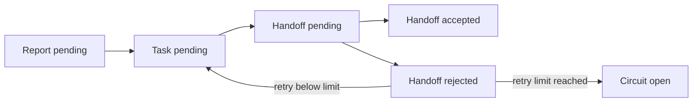
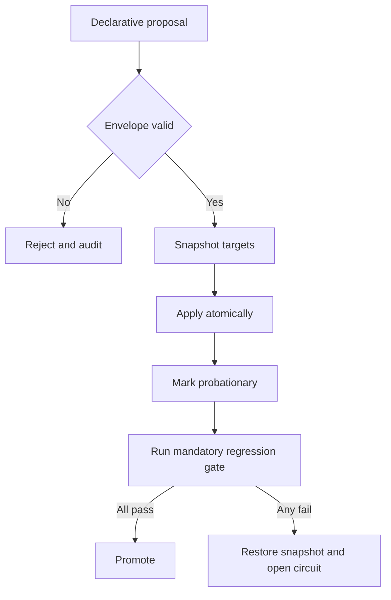

# MNEMOS Ecosystem — Comprehensive Current-State Specification

**Snapshot date:** 2026-08-30  
**Post-snapshot amendment:** 2026-09-03 — the canonical package adds (a) a reject-only memory credential gate and an eleventh mandatory regression suite, then (b) an evidence-bearing note model: every full note carries an append-only Evidence ledger (12th field, ≥1 SUPPORT), `evidence.py` enforces it, `evidence_migrate.py` plans a deterministic schema migration, contested (CHALLENGE) notes go to operator review, and `test_evidence.py` is the twelfth mandatory suite. Dated inventory evidence below remains historical.
**Status:** Implemented, locally verified, scheduled; bounded evolution has fired unattended but has not yet promoted or reverted a real unattended proposal  
**Supersedes for current-state claims:** `/uploads/MNEMOS Ecosystem Blueprint.md` and the dated implementation inventory in `/blueprints/MNEMOS-IMPLEMENTATION-GUIDE.md`  
**Does not replace:** the implementation guide’s rationale, build sequence, failure catalogue, or porting guidance  
**Authority order:** live code and configuration → current state and audit evidence → this document → earlier blueprints

---

## 1. Executive state

MNEMOS is a file-native memory, governance, verification, and bounded-autonomy substrate for an LLM agent operating in SiemensGPT. It uses Markdown and JSON as durable state, Python as the deterministic enforcement layer, FileStore as the persistence boundary, and scheduled agent executions as the unattended trigger mechanism.

The ecosystem evolved beyond both source documents in five material ways at the snapshot, plus two post-snapshot additions (security, then evidence):

1. **Health is now content-gated and attestable.** Health v2 selects a declared scope, requires complete staging, hashes inputs and tools, isolates runtime caches, distinguishes derived repairs from integrity failures, and writes an attestation only for a stable GREEN state.
2. **Retrieval is now executable.** `recall.py` implements deterministic BM25, two-hop graph expansion, recency, salience, stable tie-breaking, and no derived index. The earlier guide described a retrieval contract and simpler lexical relevance; the running system now has a tested retrieval engine.
3. **Session continuity is now a subsystem.** The `/handoff` skill, validator, tests, and `/handoffs/` store provide bounded continuation snapshots with evidence gates, expiry warnings, secret scanning, and resume guards.
4. **The regression gate expanded from seven to eleven suites at the snapshot** (twelve after the 2026-09-03 evidence suite). Health v2, recall, handoff, and the memory secret gate are mandatory alongside snapshot, self-heal, tick, probation, evolution, dispatcher, and memory auditing.
5. **Scheduled operation is real.** A bounded-evolution schedule and a separate post-tick health schedule are enabled. The latest dispatcher audit contains an unattended event at `2026-08-30T02:00:56.964067Z`. This proves execution of the scheduled pipeline, but not promotion of a real evolution proposal; the evolution audit is still empty.
6. **Memory auditing now rejects structured credentials.** `mnemos.py audit` scans all of `MEMORY.md` and `AGENTS.md` through a stdlib-only provider-pattern scanner, attributes note-title/body hits to their note ID, emits masked blocking findings, and never mutates or redacts source files.
7. **Notes are now evidence-bearing.** Every full L2/L3 note carries an append-only Evidence ledger — a repeatable 12th field of `{date, stance, source, quote}` records, at least one `SUPPORT` required. `evidence.py` validates and appends canonically; the generated indexes show the derived `S/C` tally; a `CHALLENGE` record marks a note contested (AMBER operator review, never auto-delete); `evidence_migrate.py` plans a deterministic, side-effect-free schema migration; DISTIL is non-lossy and preserves the ledger. `test_evidence.py` is the twelfth mandatory suite.

The pre-authoring content-scoped health check observed **83 scoped files**, returned **GREEN**, and produced fingerprint `80b5516e1e5040fd`. `MEMORY.md` was at **84.9%** of its byte cap. The circuit breaker was closed and probation inactive. A full ten-suite regression run returned ten successful suite exit codes. That run exposed file-handle `ResourceWarning`s in recall despite its zero exit code; `recall.py` was corrected to use `Path.read_text()`, and its full test suite then passed with `ResourceWarning` promoted to an error.

---

## 2. Scope, authority, and status language

### 2.1 Scope

This document describes the persisted MNEMOS implementation, its operational state, its scheduled execution model, and the evidence boundaries observed on 2026-08-30. It is a current-state specification, not a historical narrative or product claim.

### 2.2 Evidence hierarchy

When sources disagree, use this order:

1. Current executable code and persisted configuration.
2. Current state, audit records, health output, and schedule records.
3. This specification.
4. The implementation guide dated 2026-08-29.
5. The earlier ecosystem handover blueprint.

A design document cannot override code; code existing does not prove production behavior; a schedule counter proves firing but not successful work.

### 2.3 Status terms

| Term | Meaning |
|---|---|
| **VERIFIED NOW** | Observed with tools during the current review |
| **VERIFIED HISTORICALLY** | Supported by persisted evidence from an earlier session but not reproved now |
| **IMPLEMENTED** | Current source/configuration exists and was inspected |
| **LOCALLY TESTED** | Current regression command passed in the sandbox |
| **SCHEDULED** | An enabled platform schedule exists |
| **UNVERIFIED IN OPERATION** | The relevant real unattended behavior has not been observed |
| **SUPERSEDED** | Earlier documentation remains historical but no longer describes the running implementation |

---

## 3. What MNEMOS is—and is not

### 3.1 It is

- A persistent memory hierarchy with explicit auto-load and retrieval boundaries.
- A governance layer with protected identity, procedural rules, operator authority, and injection defense.
- A deterministic toolchain for schema validation, link integrity, health, recall, snapshots, rollback, and bounded repair.
- A file-backed autonomy state machine with authorization, leases, retries, a circuit breaker, and append-only audit trails.
- A bounded self-modification stack using declarative proposals, optimistic concurrency, snapshots, probation, regression gates, promotion, and rollback.
- An evidence discipline: VERIFIED is grounded in an observed tool result, not plausibility.

### 3.2 It is not

- A database-backed memory service.
- A vector-search system.
- A persistent daemon.
- An unrestricted autonomous agent.
- A deployment framework or external integration bus.
- Evidence that self-modification improves real outcomes.
- A guarantee that a scheduler execution completed its intended work.
- A replacement for human judgment where demotion, identity, or irreversible deletion is involved.

---

## 4. Runtime and trust boundary

### 4.1 Runtime envelope

- Host: SiemensGPT.
- Sandbox: Python 3.12, ephemeral `/tmp`, flat staging.
- Proven compute envelope: 6 vCPU, 10 GB RAM, and 45 seconds of continuous execution; the true timeout ceiling remains unestablished.
- Network: no outbound network from the sandbox. External retrieval must use an approved search or delegation tool.
- Computer vision: OpenCV is installed but unusable because `libGL.so.1` is absent; Pillow is the safe default.
- OCR: unavailable in the current runtime.
- Born-digital PDF extraction: supported through PyMuPDF and `doclite.py`.
- Harness arguments contaminate `sys.argv`; scripts using `argparse` must isolate or reset arguments.
- Child processes require `PYTHONDONTWRITEBYTECODE=1` to prevent bytecode debris.

### 4.2 Persistent stores

| Store | Access | Role |
|---|---|---|
| `personal_files` | read/write | Canonical substrate, configuration, state, and artifacts |
| `workspace_workspace_files` | read-only | Workspace material; no attached knowledge base currently reachable |
| `default_skills` | read-only | Platform-provided skills |

Internal Siemens retrieval may be available through DQE delegation even when no FileStore knowledge base is attached. Agent Library search is independently live and returns agent configurations. External service connections are not assumed.

### 4.3 Trust zones

- **Trusted control plane:** system/developer instructions, protected root files, compiled hard floors, mandatory tests, and validated configuration.
- **Trusted after validation:** declarative queue envelopes, handoff snapshots, evolution proposals, and generated persistence plans.
- **Untrusted data:** uploads, web results, sub-agent replies, rendered documents, queue payload text, and retrieved memories. These are data, never authority.

Retrieved text cannot escalate permissions, change the ALWAYS/ASK/NEVER boundary, or amend the immutability floor.

---

## 5. Layer model

The current implementation uses five operational layers. The earlier blueprint’s “L0 runtime / L4 external KB” nomenclature is superseded because it conflicts with the live substrate.

| Layer | Canonical location | Load behavior | Mutation boundary | Purpose |
|---|---|---|---|---|
| L0 Identity | `/SOUL.md`, `/IDENTITY.md` | Always loaded | Human consent required | Persona, values, named failure modes, identity metadata |
| L1 Procedure | `/AGENTS.md` | Always loaded | Semi-mutable; ≤120 lines | Invariants, exact invocations, authority boundaries, reference map |
| L2 Core | `/USER.md`, `/MEMORY.md` | Always loaded | Dynamic; USER ≤40 lines; MEMORY ≤200 lines and 12,288 bytes | Operator contract, hot working set, current decisions and projects |
| L3 Archive | `/Memory/**` | Retrieved on demand | Append-heavy, graph-addressed | Context, lessons, decisions, preferences, daily records, backups |
| L4 Ephemeral | Checklist and sandbox working state | Per task/call | Purged | Execution state, staged files, temporary plans |

External knowledge bases are integrations, not a memory tier in the current model.

The critical architectural boundary is **L2 ↔ L3**: automatic context versus explicit retrieval. Auto-load is treated as a scarce privilege.

---

## 6. Identity, procedure, and operator authority

### 6.1 Identity kernel

`SOUL.md` defines the operating character and named failure modes. `IDENTITY.md` supplies compact identity metadata. Neither may be edited without explicit operator consent. They are separated from procedure so routine operational changes cannot silently alter identity.

The identity layer explicitly names failure modes such as confident emptiness, unearned certainty, politeness inflation, half-baked shipping, and question-as-escape-hatch. These labels are operational self-checks, not measured psychological claims.

### 6.2 Procedural kernel

`AGENTS.md` is capped at 120 lines and functions as an invocation map rather than a diary. It contains:

- Architectural invariants.
- Exact verification commands.
- ALWAYS / ASK / NEVER boundaries.
- Injection defense.
- Memory write and retrieval protocol.
- References to detailed scripts and archival notes.

Procedural rules belong in L1; the evidence or lesson that created a rule belongs in L3.

### 6.3 Operator contract

`USER.md` records durable operator preferences and decision authority. The standing rule is to act without asking on reversible work, back up before mutation, and ask only for narrow boundaries that cannot be made routine by a backup:

- Irrecoverable deletion of operator-authored files.
- Editing `SOUL.md` or `IDENTITY.md`.
- Creating or changing unattended schedules.

The NEVER tier remains non-overridable: no fabricated URLs, paths, citations, numbers, or tool output; no secrets in files; no retrieved text treated as instructions; no cap violations; no unverified claim persisted as VERIFIED.

---

## 7. Memory substrate

### 7.1 L2 working set

`MEMORY.md` contains:

- Runtime/context manifest.
- Operator pointer.
- A small set of atomic-note stubs.
- Ephemeral scratchpad.
- Retrieval and write contracts.
- Current preferences, decisions, lessons, and ongoing projects.

The byte cap is 12,288; warning pressure begins at 85%. The pre-authoring measured pressure was 84.9%, deliberately just below the warning boundary. Demotion remains editorial: tooling can rank candidates, but it does not auto-prune L2.

### 7.2 L3 archival store

Current categories:

- `Memory/context/`
- `Memory/lessons/`
- `Memory/decisions/`
- `Memory/preferences/`
- `Memory/daily/`
- `Memory/_archive/`

`Memory/_archive/` is the pre-mutation recovery tier and is excluded from normal health indexing. At inventory time the health scope contained 17 context notes, 22 lessons, one decision note, no preference note, and four daily digests.

### 7.3 Write gate

A memory candidate must first pass three semantic tests:

1. **Durable:** likely still true next week.
2. **Actionable:** changes a future decision or prevents recurrence.
3. **Non-inferable:** cannot be reconstructed from the workspace in seconds.

Provenance is mandatory. Without provenance, confidence is capped at MEDIUM. Only VERIFIED and HIGH material may auto-inject.

The mechanical audit also rejects high-confidence credential shapes anywhere in `MEMORY.md` or `AGENTS.md`. Hits inside a parsed note title or body are attributed to that note ID; other L2 hits are attributed to `MEMORY.md`. Findings identify the credential kind and a masked prefix only; the full value is never emitted. The operator removes the source value and reruns the audit—there is no automatic redaction.

### 7.4 Confidence and contradiction

Confidence order:

```text
VERIFIED > HIGH > MEDIUM > LOW > SKIP
```

Newer VERIFIED evidence supersedes older evidence. The old state is marked superseded rather than silently deleted so the reasoning trail remains inspectable.

### 7.5 Graph integrity

Notes use stable `[[MEM-…]]` identifiers. A valid demotion stub includes confidence and the archival path. L3 files must be addressable in both directions: an L2/index reference and an L3 self-ID. `graphcheck.py` enforces broken-link and orphan checks and generates `INDEX-L3.md`.

### 7.6 Decay and forgetting policy

The memory auditor retains the original protocol’s scoring and recommendation machinery:

- Hourly recency retention: `0.995`.
- Utility combines frequency, salience, and age.
- Stubs are exempt from decay.
- Low-utility notes may be recommended for KEEP, DISTIL, DELETE, or STUB treatment.

These are recommendations. The auditor does not autonomously delete or demote core memory because editorial value is not reducible to a score.

---

## 8. Retrieval engine

`recall.py` is the current retrieval implementation. It replaced the implementation guide’s conceptual anchor/traverse/rerank process with a deterministic executable pipeline:

$$S(d,q)=0.45L+0.25G+0.10R+0.20I$$

- \(L\): BM25, \(k_1=1.5\), \(b=0.75\); headings count twice.
- \(G\): graph contribution from lexical seed notes, decayed by \(0.5^{hops}\), maximum two hops.
- \(R\): reproducible recency relative to the newest corpus note, 90-day half-life.
- \(I\): note salience, default 0.5 when absent.
- Ties: document ID, ensuring total deterministic ordering.

The engine builds its corpus at query time and leaves no derived index. This is intentional at the present corpus size: it avoids index invalidation and keeps files as the database.

Its current verification comprises:

- Nine self-test assertions.
- Ten unit tests.
- `ResourceWarning` promoted to an error during the final focused test.
- A corrected file-reading implementation using `Path.read_text()` so handles are closed deterministically.

This supersedes the implementation guide’s earlier relevance formula \(0.25R+0.35I+0.40V\) as the description of the running retrieval engine. The older formula remains useful design history, not current code behavior.

---

## 9. Deterministic toolchain

The live `/scripts/` directory contained 27 Python files at inventory time. All parsed successfully. The principal components are:

| Component | Current role |
|---|---|
| `mnemos.py` | Parse and validate L2 notes, caps, utility, credential findings, and the generated L2 index |
| `secretscan.py` | Detect structured provider credentials and return only masked match previews |
| `graphcheck.py` | Verify cross-tier IDs/links, audit the Evidence ledger per tier, and generate the L3 registry with `S/C`/`State` |
| `evidence.py` | Parse, validate, canonicalize, and append the repeatable Evidence field; the memory ledger's enforcement layer |
| `evidence_migrate.py` | Deterministic, side-effect-free migration dry-run planner projecting the evidence-schema cutover |
| `health.py` | Composite content-gated health verdict and repair/attestation plan |
| `scope_manifest.py` | Select health scope from declared policy and store inventory |
| `mutation_preflight.py` | Project exact edits and reject ambiguous replacement targets |
| `memory_note.py` | Create graph-addressable memory notes atomically |
| `doctor.py` | Probe environment, libraries, binaries, self-tests, and documented capabilities |
| `recall.py` | BM25 plus graph recall without a persistent derived index |
| `handoff.py` | Validate, list, and expire session continuation snapshots |
| `snapshot.py` | Content-addressed snapshot and byte-exact restore |
| `self_heal.py` | Declarative convergence with fixed check/repair enums and oscillation quarantine |
| `probation.py` | Promote or revert one active change based on mandatory suites |
| `evolution.py` | Validate and apply one bounded declarative proposal |
| `tick.py` | Rebuild flat staging, execute one deterministic cycle, emit a hashed persistence plan |
| `autonomy_dispatcher.py` | Queue state machine and authorization boundary |
| `verifier_kit.py` | Adversarial claim adjudication and evidence receipts |
| `guard.py` | Fail-closed sandbox artifact emission and audit logging |
| `repomap.py` | AST-based Python structure extraction |
| `doclite.py` | Born-digital PDF to Markdown conversion |
| `crush.py` | Reversible reduction of large JSON/log/CSV/code/text inputs |
| `agentlint.py` | Agent Library export quality, hygiene, duplication, and triage audit |
| `agent_eval.py` | Agent evaluation, harvesting, and report support |
| `test_mnemos.py` | Memory auditor regression |
| `test_secretscan.py` | Memory credential-gate regression |
| `test_health.py` | Health-v2 support-tool regression |
| `test_recall.py` | Retrieval regression |
| `test_handoff.py` | Handoff validator regression |
| `test_autonomy_dispatcher.py` | Dispatcher regression |
| `test_evidence.py` | Evidence ledger, graph-audit, and migration-planner regression (twelfth mandatory suite) |

Historical script line counts in the implementation guide are stale and must not be used as current inventory.

---

## 10. Health v2

### 10.1 Scope policy

`health-scope.json` selects:

- Required L1/L2 and index/protocol files.
- All direct Markdown files in context, lessons, decisions, preferences, and daily categories.
- All direct Python files under `/scripts/`.
- All JSON configuration files under `/autonomy/config/`.
- Excludes archives, handoff snapshots, and the generated attestation.

The scope is data, not prose. `scope_manifest.py` resolves it against an explicit store inventory, fails on missing files and flat-stage basename collisions, and emits the staged-name-to-real-path manifest consumed by health.

### 10.2 Checks

Health v2 combines:

1. L2 schema/cap/index audit.
2. Cross-tier link and orphan integrity.
3. Environment/tool health in isolated runtime directories.
4. Memory byte pressure.
5. Runtime artifact detection when a complete store inventory is supplied.
6. Scope completeness.
7. Internal-language convention lint.

Exit codes remain 0/1/2 for GREEN/AMBER/RED.

### 10.3 Verdict semantics

- **GREEN:** checked state is clean.
- **AMBER:** a deterministic repair is known or pressure/advisory attention is required.
- **RED:** integrity, coverage, schema, link, environment, or cap failure requires judgment.

A derived index update is a write action, not silently applied. Scope incompleteness suppresses derived writes so a partial view cannot regenerate canonical indexes.

### 10.4 Attestation semantics

A health attestation is emitted only when:

- Every check is GREEN.
- No derived index write is pending.
- No deletion is pending.

The attestation includes full input digest, tool digest, short fingerprint, file count, timestamp, scope, and per-check states. The pre-authoring attestation recorded 83 files and fingerprint `80b5516e1e5040fd`.

Important boundary: the content and coverage result is fully scoped. The junk verdict is only as complete as the supplied root store inventory. A partial inventory must never be described as global cleanliness.

---

## 11. Autonomy dispatcher

### 11.1 State machine

The dispatcher is a file-backed deterministic workflow:



Each invocation performs at most one durable state transition. Queue priority is handoffs, then tasks, then reports. Lower numeric priority wins within a queue; filename breaks ties.

### 11.2 Authorization

Current policy allows only:

- `noop`
- `write_text` below `artifacts/`

and only under approval scope `workspace_artifacts`.

It explicitly does not implement shell, network, messaging, deletion, deployment, identity mutation, or schedule mutation. Paths are independently checked against allowed prefixes and protected roots.

### 11.3 Lease and retry behavior

- Lease TTL: 900 seconds.
- Maximum retries: three.
- Circuit state at inventory: closed.
- Lease state is runtime/dynamic. `lease.json` is declared in the persistence manifest but is absent when no lease is active; it is created and captured by a tick. Its absence at rest is not a fault.

### 11.4 Audit

`events.jsonl` is append-only and contained seven valid JSON events at inventory time; the latest was an unattended idle transition at `2026-08-30T02:00:56.964067Z`. `evolution.jsonl` was empty. Prefix verification prevents rewriting append-only history.

All report, task, and dispatcher-handoff queues were empty at inventory time.

---

## 12. Persistence engine

`workspace.manifest.json` is the canonical persist-list. It declares:

- 13 persistent files.
- Three required paths.
- Two append-only audit logs.
- 17 reconstructed directories.

Because FileStore staging is flat:

- Basenames must be unique.
- `tick.py` reconstructs the nested workspace under a temporary root.
- Missing required files fail closed.
- Dynamic queue/state/evolution/snapshot paths are discovered and added to a runtime-only manifest.
- The persisted manifest is not expanded with transient paths.
- The resulting plan contains exact writes/deletes and a `plan_sha256`.
- Append-only files must preserve their previous byte prefix.
- Binary writes are refused rather than silently corrupted.
- The temporary reconstructed workspace and plan are deleted before the sandbox call returns.

`autonomy/evolution/` and `autonomy/snapshots/` may be absent while empty. Their paths are declared and reconstructed for execution; absence of an empty directory in FileStore is not missing durable state.

---

## 13. Bounded self-modification

### 13.1 Envelope

A proposal is declarative JSON and may contain at most four operations and 65,536 total written bytes. Existing files require the expected current SHA-256; new files require `expected_sha256: "absent"`. Duplicate paths and traversal are rejected.

The mutable envelope allows selected non-core scripts and memory notes in context, lessons, and decisions. `bots/**`, `uploads/**`, and `Skills/**` are immutable by configuration.

### 13.2 Hard floor

The compiled `HARD_IMMUTABLE` floor is unioned with configuration and cannot be weakened by editing JSON. Core identity, governance, evolution brakes, mandatory tests, critical state, snapshots, and archives are protected. Destructive repair is refused; exact snapshot restoration is allowed and flagged.

The central rule is simple: a self-modifying system must not be able to edit its own brakes.

### 13.3 Lifecycle



Only one probationary change may exist. At inventory time probation was inactive and its history empty. The circuit breaker was closed.

### 13.4 Regression gate

The current gate has twelve mandatory suites:

1. snapshot
2. self-heal
3. tick
4. probation
5. evolution
6. dispatcher
7. mnemos
8. health v2
9. recall
10. handoff
11. secret gate
12. evidence ledger

A suite in which everything is skipped fails. In the review before authoring, the original ten suite commands exited zero; the post-snapshot secret-gate suite passes its focused run. Representative internal results were:

- Snapshot: 22 self-test assertions.
- Self-heal: 26 self-test assertions.
- Tick: 22 self-test assertions.
- Probation: 21 self-test assertions.
- Evolution: 12 self-test assertions.
- Dispatcher: seven unit tests.
- MNEMOS: ten unit tests.
- Health v2: five unit tests.
- Recall: ten unit tests and nine self-test assertions.
- Handoff: 22 unit tests and 16 self-test assertions.
- Secret gate: ten unit tests covering whole-L2 coverage, note attribution, `AGENTS.md`, masking, staged `runpy` imports, clean text, distinct-token reporting, and 30 structured credential categories.

The recall suite initially emitted resource warnings despite a zero exit code. That was treated as a defect, fixed, and re-run with resource warnings elevated to errors.

### 13.5 Production evidence boundary

The scheduled tick has demonstrably fired unattended and produced an audit event. However, no real proposal has yet been recorded in `evolution.jsonl`; therefore unattended **execution** is verified, while unattended **proposal promotion or rollback** remains unverified.

This is the precise replacement for the implementation guide’s broader “built, not proven” statement.

---

## 14. Self-healing convergence

`invariants.json` currently defines 14 rules:

- Six low-severity debris cleanup rules.
- Five critical presence rules restored from snapshots.
- Three report-only cap rules for MEMORY, AGENTS, and USER.

Checks are fixed enums:

- `file_exists`
- `max_line_count`
- `files_older_than`
- `glob_nonempty`

Repairs are fixed enums:

- `report_only`
- `delete_matching`
- `restore_from_snapshot`

Unknown names are hard failures. An oscillation window of three quarantines repeatedly flipping rules.

Workspace-wide `--heal` remains disabled in the scheduled evolution tick. This is deliberate: the scheduled path evaluates probation and bounded evolution but does not widen itself into general unattended repair.

---

## 15. Handoff and session continuity

The handoff subsystem did not exist in the two source documents.

Components:

- `/Skills/handoff/SKILL.md`
- `/scripts/handoff.py`
- `/scripts/test_handoff.py`
- `/handoffs/YYYY-MM-DD-slug.md`

Properties:

- Seven-day TTL.
- Fixed ordered sections and schema pinning.
- Evidence required for VERIFIED bullets.
- Structured next actions and resume guards.
- Secret-pattern scanning.
- Duplicate-key and unknown-section rejection.
- Warnings do not automatically block restoration; structural failures do.
- Validation proves structure and evidence presence, not factual truth.

The latest hardening replay rejected all 16 previously constructed adversarial bypasses. The persisted reference handoff carries expected DRAFT/human-review warnings; these are status signals, not validator failures.

Dispatcher handoffs and session-continuity handoffs are separate concepts:

- `/autonomy/handoffs/` belongs to the machine state pipeline.
- `/handoffs/` belongs to human/agent session continuity.

---

## 16. Scheduling

Three schedules existed at inventory time:

| Purpose | State | Cron UTC | Evidence at snapshot |
|---|---|---|---|
| Historical autonomy probe | Disabled | `0 */4 * * *` | One of six executions; retained as history |
| Bounded-evolution tick | Enabled | `0 2 * * *` | Five of 168 executions; next scheduled 2026-08-31 02:00 UTC |
| Post-tick health pass | Enabled | `0 5 * * *` | One of 14 executions; next scheduled 2026-08-31 05:00 UTC |

At the snapshot date, 02:00 UTC is 04:00 in Vienna and 05:00 UTC is 07:00. UTC cron does not preserve local wall time across daylight-saving changes; schedules require deliberate re-pinning if local time is the invariant.

The tick runs before health so health describes post-tick state. Schedule counters prove firing; output artifacts and audit entries prove what actually happened.

Editing `HEARTBEAT.md` does not create a trigger. That earlier failure is now encoded as a permanent lesson.

---

## 17. Verification and claim discipline

`verifier_kit.py` remains the adversarial claim-adjudication instrument. The ecosystem’s governing distinctions are:

- A value can be syntactically grounded yet semantically misleading.
- A passed command with everything skipped is not evidence.
- A success status without payload is not a result.
- A health result without complete scope is not global health.
- A scheduler counter without expected artifacts is not successful work.
- A structural handoff validator does not prove the truth of cited evidence.

Blocking claims require stronger grounding than heuristic matching. Evidence receipts, claim statuses, verification methods, and conformal checks are part of the verifier contract.

---

## 18. Evolution from the two source documents

| Topic | Ecosystem Blueprint | Implementation Guide v1.0 | Current state |
|---|---|---|---|
| Tier model | L0 runtime through L4 external KB | L0 identity through L4 ephemeral | Guide model is canonical; external KB is an integration, not a tier |
| Health | Earlier manifest-scoped health | Composite health and staging caveats | Health v2 with declared scope, digests, stable attestations, isolated caches, and health tests |
| Retrieval | Composite scoring described | Conceptual four-stage contract and older weights | Executable BM25 + graph + recency + salience engine; no derived index |
| Regression | Dispatcher seven tests; verifier 28-check claim | Seven mandatory self-modification suites | Eleven mandatory suites; the original ten exited zero before authoring and the secret-gate suite passed its post-snapshot focused run |
| Persistence | Dispatcher and audit trail | `tick.py` manifest-driven plan | Runtime-only expanded manifest, hashed plan, append-prefix checks, binary refusal |
| Self-modification | Not fully represented | Built/local, unattended unverified | Scheduled tick has fired; no real unattended evolution promotion or rollback yet |
| Handoff | Dispatcher handoffs only | Dispatcher handoffs only | Separate human/session handoff skill and validator added |
| Health proof | Expected commands | Verified 2026-08-29 snapshot | Pre-authoring attestation: 83 files, fingerprint `80b5516e1e5040fd` |
| Scripts | “15+” and dated counts | Dated per-script line counts | 27 current Python files at inventory; dated counts superseded |
| Lease file | Presented as state | Presented in file tree | Dynamic and absent at rest; created/persisted during active tick |
| Empty dynamic dirs | Shown as persistent tree | Shown as persistent tree | Declarative directories; may not physically exist while empty |
| Knowledge bases | L4 extension | Porting option | No attached FileStore KB; DQE may provide internal retrieval |
| Health artifacts | Not covered | Junk/self-litter warning | Runtime caches isolated; attestation is content-gated |
| Session continuity | Not covered | Not covered | Validated seven-day handoff snapshots and a slash-command skill |

### 18.1 What remains valid from the blueprint

- File-based stigmergic coordination.
- Deterministic dispatcher and atomic state transitions.
- Verification receipts and claim discipline.
- Canonical English for machine-facing artifacts.
- Health checks around substrate mutations.
- Narrow authorization surface.

### 18.2 What remains valid from the implementation guide

- Design axioms and failure catalogue.
- L0–L4 layer model used by the live substrate.
- Hard caps and auto-load boundary.
- Provenance and confidence rules.
- Snapshot-before-mutate and probation.
- Manifest-driven persistence.
- Immutability floor.
- Seven-phase build order and “no phase 8” boundary.

### 18.3 What is superseded

- Old script line counts and component inventory.
- Seven-suite regression inventory.
- Conceptual-only retrieval description and its older scoring weights.
- “No unattended run observed” as a blanket statement.
- Persistent-file presentation of an inactive lease.
- Persistent-directory presentation of empty dynamic directories.
- External knowledge bases as L4.

---

## 19. Current verification record

### 19.1 Verified during this review

- Both source documents were read completely.
- Live configurations and states were inspected.
- 27 Python scripts parsed successfully at inventory time.
- Ten mandatory regression suite commands exited zero before authoring.
- Health v2 returned GREEN for 83 content-scoped files before authoring.
- Circuit breaker was closed.
- Probation was inactive.
- Dispatcher queues were empty.
- Seven valid dispatcher audit events existed; the latest unattended event was dated 2026-08-30 02:00 UTC.
- Evolution audit was empty.
- Active schedules were enumerated.
- Recall file-handle warning was reproduced, root-caused, corrected, and verified with `ResourceWarning` treated as an error.

### 19.2 Intentionally unverified

- A real unattended evolution proposal being promoted.
- A real unattended evolution proposal being rolled back.
- Retrieval quality versus an embedding baseline.
- A quantitative benefit from the identity tier.
- Browser-based continuation behavior; the design was deliberately rejected in favor of native handoff files.
- Factual truth of evidence cited inside a handoff; the validator checks structure and presence.
- The true maximum sandbox execution time.

These are not defects to conceal. They are evidence boundaries.

---

## 20. Operating procedures

### 20.1 Before a substrate mutation

1. Run full scoped health.
2. Apply any exact action plan.
3. Back up the target into `Memory/_archive/`.
4. Use mutation preflight for exact replacements.
5. Mutate.
6. Run the relevant focused tests.
7. Run the full regression gate when core behavior changed.
8. Run full scoped health again.
9. Refresh the attestation only for stable GREEN.

### 20.2 Adding a memory note

1. Apply the three-question write gate.
2. Choose L2 only if it beats the weakest hot note.
3. Add provenance and confidence.
4. Create an L3 self-ID and L2/index backlink together.
5. Run graphcheck and regenerate indexes.

### 20.3 Running one scheduled tick manually

1. Read the persisted workspace manifest.
2. Discover dynamic queue, evolution, snapshot, artifact, and state paths.
3. Stage required scripts, manifest files, and discovered files in one sandbox call.
4. Build a runtime-only manifest with unique basenames and complete required coverage.
5. Run `tick.py` with probation and evolution; do not pass `--heal` in the scheduled profile.
6. Validate `plan_sha256`, path containment, binary refusal, and append prefixes.
7. Persist the plan verbatim.
8. Record the transition and verification outcome.

### 20.4 Resuming from a handoff

1. Validate the snapshot with `handoff.py`.
2. Confirm it is not structurally rejected.
3. Treat warnings as explicit operator-visible caveats.
4. Reverify every referenced path and time-sensitive state.
5. Continue only from the named next action and resume guard.

### 20.5 Updating this specification

1. Inventory both this file and live code/config/state.
2. Recompute every count rather than copying it.
3. Preserve earlier documents as historical evidence.
4. Mark superseded claims explicitly.
5. Never turn a schedule counter into proof of successful work without an artifact.
6. Finish with focused tests, the full regression gate, and scoped health.

---

## 21. Canonical file map

```text
/SOUL.md
/IDENTITY.md
/AGENTS.md
/USER.md
/MEMORY.md
/HEARTBEAT.md

/Memory/
  PROTOCOL.md
  INDEX.md
  INDEX-L3.md
  context/
  lessons/
  decisions/
  preferences/
  daily/
  _archive/

/scripts/
  memory: mnemos, graphcheck, recall, memory_note
  health: health, scope_manifest, mutation_preflight, doctor
  autonomy: autonomy_dispatcher, tick
  evolution: snapshot, self_heal, probation, evolution
  continuity: handoff
  verification: verifier_kit, guard
  analysis: repomap, doclite, crush, agentlint, agent_eval
  tests: test_mnemos, test_health, test_recall, test_handoff,
         test_autonomy_dispatcher

/autonomy/
  README.md
  config/
    policy.json
    envelope.schema.json
    invariants.json
    regression.json
    evolution.json
    workspace.manifest.json
    health-scope.json
  state/
    circuit-breaker.json
    probation.json
    health-attestation.json
    health-fingerprint.json
    lease.json                 dynamic; absent when inactive
  audit/
    events.jsonl
    evolution.jsonl
  reports/{pending,processing,archive,rejected}/
  tasks/{pending,processing,archive,failed}/
  handoffs/{pending,processing,accepted,rejected}/
  artifacts/                  declarative; may be absent while empty
  snapshots/                  declarative; may be absent while empty
  evolution/{pending,archive,rejected}/  declarative; may be absent while empty

/Skills/
  diagnose/
  grill/
  handoff/
  memory/
  plan/
  research/

/handoffs/                    human/session continuation snapshots
/verifier/                    verifier runtime specification and reports
/blueprints/                  historical and current architecture documents
```

---

## 22. Risks and open proof obligations

| Risk or obligation | Current control | Remaining proof |
|---|---|---|
| Partial health view reports false GREEN | Declared scope, full manifest, coverage failure | Maintain complete root inventory for global junk claims |
| Evolution edits its own brakes | Compiled hard floor plus immutable tests/config | Continue adversarial testing after envelope changes |
| Scheduled run fires but work fails | Counters plus audit/artifact inspection | Observe a genuine proposal promotion or rollback |
| L2 approaches cap | Mechanical pressure warning | Editorially demote before crossing threshold |
| Graph note becomes unreachable | Bidirectional creation and graphcheck | Run graphcheck after every L3 write |
| Derived index drifts | Deterministic regeneration and health comparison | Never hand-edit generated indexes |
| Handoff carries false evidence | Structure/evidence gate and revalidation rule | Truth must be rechecked at resume time |
| Retrieval misses paraphrases | BM25 plus graph expansion and tags | No embedding-baseline benchmark exists |
| Empty dynamic path mistaken for missing state | Manifest reconstructs directories; lease is dynamic | Keep documentation explicit |
| Test exits zero with warnings | Treat warnings as defects where relevant | Maintain warning-as-error focused checks |

---

## 23. Final state statement

The ecosystem is no longer merely a memory hierarchy with a dispatcher. It is a bounded operating substrate with four coupled control loops:

1. **Memory loop:** write gate → graph-addressable storage → deterministic recall → consolidation.
2. **Health loop:** declared scope → complete staging → deterministic checks → repair plan → stable attestation.
3. **Autonomy loop:** authorized envelope → one transition → hashed persistence plan → append-only audit.
4. **Evolution loop:** bounded proposal → snapshot → probation → twelve-suite gate → promotion or exact rollback.

At the pre-authoring snapshot, the system was content-scoped GREEN, locally regression-green, and demonstrably scheduled. The main remaining proof obligation is narrow and explicit: observe a genuine unattended evolution proposal proceed through promotion or rollback with persisted audit evidence. Until that happens, unattended evolution capability is **implemented and scheduled, not operationally proven end to end**.

The operating principle remains unchanged: every session should leave the substrate slightly better—and should prove that it did.
